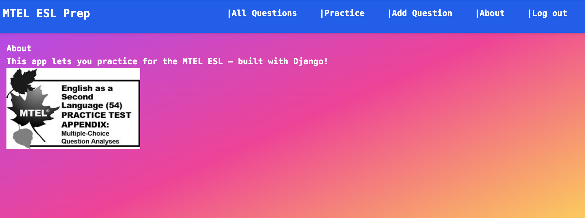

# MTEL ESL Practice Test App

###### Image: A user-facing page where learners can take an ESL practice test with multiple question types.

## Background:

The MTEL ESL Practice Test App was designed to help educators and students prepare for the Massachusetts Tests for Educator Licensure (MTEL) in ESL. The app allows users to create, take, and review practice tests modeled after the official MTEL format. It was built as a capstone Django project to demonstrate database management, form handling, and dynamic template rendering.

Developer: **Paul Kniaz**

## Getting Started:

Sign up or log in to create, edit, and manage your own ESL practice tests.
You can:

* Add **Multiple Choice**, **Short Answer**, or **Long Answer** questions.
* Build and name your own **Practice Tests**.
* Take a test and view **instant results** for multiple choice sections.
* Review and reflect on written responses with sample answers.

## Planning Materials:

[GitHub Repository](https://github.com/eslteacher902010/mteleslprep)
[Deployed Site](https://mtel-esl-prep.herokuapp.com/)

## Attributes:

**CSS Styling*:
Tailwind CSS, Flexbox, and custom responsive layouts

**Technologies Used*:
Django, Python, PostgreSQL, SQLite, HTML, CSS, Tailwind, Gunicorn, Whitenoise, Heroku, GitHub, VSCode

**Planned Future Enhancements*:

* Adding a teacher dashboard to track student results
* Including WIDA-aligned question tagging
* Expanding auto-grading logic for open-ended responses
* Integrating progress visualization with charts and graphs
* Need to fix scoring also.

---

Would you like me to make a slightly shorter “portfolio version” next (2–3 paragraphs with a polished summary + skills section) that you could also use for LinkedIn or your GA showcase page?
